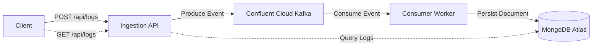

# 🚀 Scalable Event-Driven Activity Logger

    

A cloud-native **microservices-based logging platform** designed to ingest, stream, and persist user activity logs at scale. The system follows an **Event-Driven Architecture (EDA)** using **Apache Kafka** to decouple high-throughput ingestion from storage, ensuring reliability, scalability, and responsiveness under load.

---

## 🌐 Live Demo

The application is deployed on an **AWS EC2** instance running a **K3s Kubernetes cluster**.

* **Base URL:** [http://54.173.192.160/api/logs](http://54.173.192.160/api/logs)

> ℹ️ Accessing the URL via a browser triggers a `GET` request that retrieves stored logs. To create new log events, use the `POST` method as shown below.

---

## 🏗 System Architecture

The platform uses a **Producer–Consumer** model to keep the API responsive while handling high write volumes.



### Key Components

* **Ingestion Service (API):**
  A lightweight Node.js (Express) REST API that validates requests and immediately publishes events to Kafka.

* **Message Broker (Kafka):**
  Acts as a durable, scalable buffer that absorbs traffic spikes and guarantees message delivery even if downstream services are slow or temporarily unavailable.

* **Processing Service (Consumer Worker):**
  A dedicated service that consumes events from Kafka and performs I/O‑intensive operations such as writing logs to MongoDB.

* **Storage Layer (MongoDB Atlas):**
  Cloud-native document database used to store flexible, schema-less activity logs.

---

## 📂 Project Structure

```bash
├── src/
│   ├── config/              # Kafka & MongoDB configuration
│   ├── interfaces/          # HTTP routes and server setup
│   ├── services/            # Producer & Consumer business logic
│   └── app.js               # Application entry point
├── k8s/                     # Kubernetes manifests (Deployment, Service, Ingress)
├── k8s-secrets.example.yaml # Secrets template (no real credentials)
├── Dockerfile               # Container definition
└── README.md                # Documentation
```

---

## 🛠️ Setup & Installation

### Prerequisites

* Node.js v18+
* Docker
* kubectl (for Kubernetes deployment)
* MongoDB Atlas account
* Confluent Cloud (Kafka) account

---

### 1. Security Configuration (Required)

Sensitive credentials are intentionally excluded from the repository.

Create a secrets file from the provided template:

```bash
cp k8s-secrets.example.yaml k8s-secrets.yaml
```

Update `k8s-secrets.yaml` with your actual MongoDB and Kafka credentials.

---

### 2. Run Locally with Docker

```bash
# Build the image
docker build -t activity-log-app .

# Run the container (pass environment variables or use a .env file)
docker run -p 3000:3000 activity-log-app
```

The API will be available at `http://localhost:3000/api/logs`.

---

### 3. Deploy to Kubernetes (K3s)

```bash
# Apply secrets (ensure k8s-secrets.yaml exists)
kubectl apply -f k8s-secrets.yaml

# Deploy application components
kubectl apply -f k8s/deployment.yaml
kubectl apply -f k8s/service.yaml
kubectl apply -f k8s/ingress.yaml

# Verify deployment
kubectl get pods -w
```

---

## 📡 API Usage

### 1. Create a Log Event (Producer)

Queues a new activity log event in Kafka.

**Request:**

```bash
curl -X POST http://54.173.192.160/api/logs \
  -H "Content-Type: application/json" \
  -d '{"userId":"12345","action":"User_Login","metadata":{"ip":"192.168.1.1"}}'
```

**Response:**

```json
{
  "status": "Logged",
  "traceId": "a1b2c3d4",
  "message": "Event queued successfully"
}
```

---

### 2. Retrieve Logs (Read)

Fetches processed logs stored in MongoDB.

```bash
curl -X GET http://54.173.192.160/api/logs
```

---

## 🧠 Design Decisions & Trade-offs

| Decision            | Rationale                                                                                               |
| ------------------- | ------------------------------------------------------------------------------------------------------- |
| **Kafka**           | Decouples ingestion from persistence, keeping the API fast during traffic spikes or database slowdowns. |
| **Microservices**   | Allows independent scaling (e.g., multiple consumers with a single API instance).                       |
| **Kubernetes**      | Provides self-healing, horizontal scaling, and secure secret management.                                |
| **MongoDB**         | Flexible schema fits diverse activity log structures.                                                   |
| **Secrets via K8s** | Prevents credential leakage and keeps images environment-agnostic.                                      |

---

## 🚀 Future Improvements

* **CI/CD Pipeline:** GitHub Actions for automated build, test, and deployment.
* **Observability:** Prometheus & Grafana for API latency, Kafka consumer lag, and throughput metrics.

##
